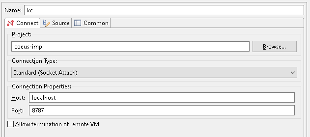

## Kuali Research (local debug/development)

This a dockerized quickstart for getting the full service suite for Kuali running on your laptop/workstation without the need to go through all the related steps and configuring. Since there are several services we use, docker-compose is used. The services are:

- [Kuali Research]([bu-ist/kuali-research](https://github.com/bu-ist/kuali-research))
- [Cor-main]([bu-ist/kuali-core-main](https://github.com/bu-ist/kuali-core-main))
- [Dashboard]([bu-ist/kuali-research-portal](https://github.com/bu-ist/kuali-research-portal))
- [Pdf](https://github.com/KualiCo/research-pdf)
- ~~Conflict of Interest~~

### Prerequisites:

- **[Git](https://git-scm.com/downloads)**

- **Docker:**
  The docker installation should include docker-compose. Installation steps vary depending on operating system. For linux:

  ```
  sudo curl -fsSL https://get.docker.com/ | sh
  usermod -aG docker [your username] (adds your username to the docker group)
  ```

- **Bash:**
  There are a few helper scripts written in bash that help setting up and validating the workspace for running docker. Natively, you can do this on a mac, though there may be some minor syntax/version differences that might prevent the scripts from working correctly. In that event, or if running windows, you can either:

  - Clone the repo on a linux box (ie: an ec2 instance), install the other prerequisites and run there.
  - Download [gitbash](https://git-scm.com/downloads)
  
- **Eclipse IDE:**
  Any java IDE will do, though the steps below are documented for [Eclipse](https://www.eclipse.org/downloads/)

### Steps:

1. **Download & Build kuali-research:**
   The kuali-research docker container will need to mount to the web application directory produced by maven during the package lifecycle phase.
   Example: `kuali-research/coeus-webapp/target/coeus-webapp-2001.0040`
   The mount maps to the tomcat webapps directory inside the container where it will be picked up for deployment when tomcat boots up.
   Follow these steps: [Build Kuali-Research](kc/kc.md)
   
2. **Clone this repository.**

   ```
   git clone https://github.com/bu-ist/kuali-local.git
   cd kuali-local
   ```

3. **Make configurations:**
   Copy the file ./parameters.sh.example as ./parameters.sh

   ```
   cd kuali-local
   cp parameters.sh.example parameters.sh
   ```

   Open parameters.sh and modify values as necessary:

   - **VIRTUAL_HOST:**
      Defaults to localhost. This is most likely what you need, but if you have created a different host name you can enter it here.
      You can create a new host name by making an entry to the hosts file on your system: [hosts file](https://www.howtogeek.com/howto/27350/beginner-geek-how-to-edit-your-hosts-file/) 
   - **DB_HOST:**
      The oracle database is the only pre-existing resource that you need to reference outside of those run by docker-compose.
      Example: `buaws-kuali-db-qa001.bu.edu`
   - **KCOEUS_PASSWORD:**
      The password of the KCOEUS user for the kuali-research oracle database
   - **KC_ROOT:**
      The location on your file system where you cloned the kuali-research git repository. The kuali-research container will bind mount to the coeus-webapps target folder and loads what it finds as a web application.
      - Windows example: `C:/kuali/kuali-research`
      - Mac or Linux system: `/home/myself/kuali-research`

4. **Create "cor-main" host:**
   Put the following entry in your systems [hosts file](https://www.howtogeek.com/howto/27350/beginner-geek-how-to-edit-your-hosts-file/):

   ```
   127.0.0.1 cor-main
   ```

   [long-winded explanation for doing this](nginx/workaround.md)

5. **Run kuali-research:**
   This is a docker-compose application, however, running `docker-compose up` alone is not enough and needs to be preceded by a series of preparatory steps. Therefore a helper script is provided so that running the app can still be a one line command.
   Each command applies to all services that are running. To limit the command to just one service, include the name of that service as an additional argument to the command. Service names can be looked up this way:

   ```
   docker-compose ps --services
   ```

   <u>COMMANDS:</u>

   - You would typically run this as a first time command. It includes directory and certificate creation prior to running docker.
      
      > NOTE: First time use may take a while since docker images will have to be downloaded from the registry and the kuali-research image will be built. These actions will not occur on subsequent runs of this command.

      ```
      sh main.sh up
      ```

   - This command is equivalent to running "`docker-compose down`", which will stop and remove all containers. 
      Bind-mounts, certificates, etc. will be left behind and be reused when next you run the up command. 
      
      ```
      sh main.sh down
      ```
      
      To bring down only one container and leave the rest running, use:
      
      ```
      sh main.sh down [service name]
      ```
      
   - Use this command to stop all services *(the containers will remain, but won't be running)*.
      
      ```
      sh main.sh stop
      ```
   
   - Use this command to stop and restart all services.
      
      ```
      sh main.sh restart
      ```

   - Use this command to stop and remove all containers AND restart everything from scratch.
      The workspace is essentially "cleaned", removing all bind-mount directories and certificates, restoring to the state when first having cloned from the git repository. Services are then brought up.
      
      > NOTE: Mongo database state that usually survives between service restarts will have been lost. 
      
      ```
      sh main.sh new
      ```
      
   
   It may take some time for the kuali-research service to start up.
   To follow its progress, you can tail the log:
   
   ```
   tail -f kc/kc_tomcat_logs/catalina.log
   ```
   
6. **Browse the application:**
   Open your browser to the following:

   ```
   http://localhost/dashboard
   ```

7. **Debug kuali-research:**
   Once the kuali-research service is running in docker, you can set up a remote debug configuration to step through code in your eclipse environment.

   1. Open eclipse to a workspace pointing at the kuali-research directory cloned when obtaining the source code from git.

   2. Create a maven project at the root of the workspace.

   3. Right-click the coeus-impl project and select:

      ```
      Debug As --> Debug Configurations... --> Remote Java Application.
      ```

      Fill out as shown here:
      
      
   4. Once running, put a breakpoint in the source code somewhere and navigate in your browser somewhere you believe should trigger code execution where you put the breakpoint and you should see execution break on that line:
   
         

