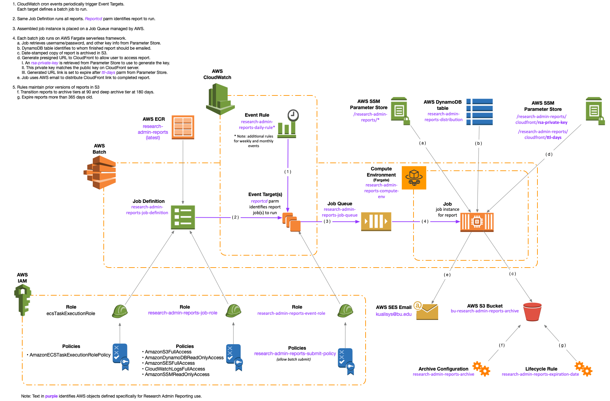
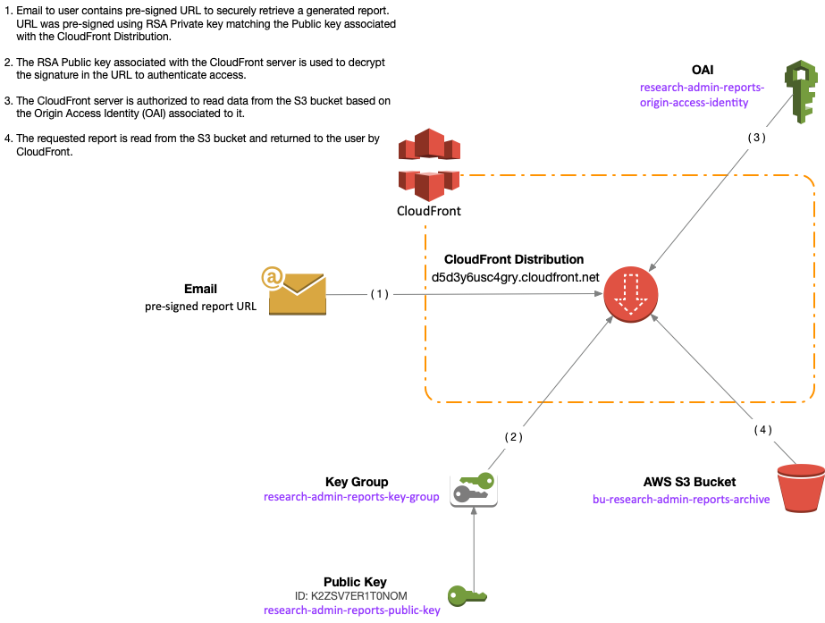
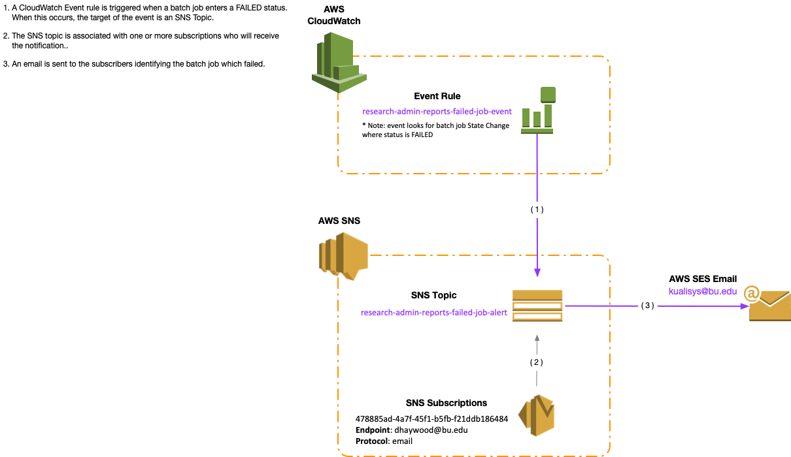

## Kuali Research Batch Reporting 

#### Description

Contains Dockerfile used in AWS Batch to produce periodic batch job reports for Research Administration. AWS Batch jobs are scheduled via a Cloudwatch Event Rule cron schedule. 

#### Overview

There is a Python 3 script for each batch job. The script to run is determined by an input parameter. A loader script (\_loader.sh) copies the selected report from the *code* folder to the *automated* folder to run. This includes copying the Python 3 driver (\_main.py) along with the needed sql scripts contained within the particular batch job subfolder. 

Each script follows a similar model and uses common helper modules. Each script:

* Runs SQLcl passing one or more SQL scripts to Oracle to return a CSV file for each script.
* Optionally formats CSV report(s) into an Excel sheet.
* Emails report to  users based on data in an AWS DynamoDB table. 
* Posts CSV or Excel report to Amazon S3.

#### Details on Building Docker Image

1. ~~Download a current copy of SQLcl as a zip file from Oracle.~~

2. ~~Place zip file in git repo containing Dockerfile. A (hidden) .gitignore file in this repo prevents tracking the zip file.~~

   > Steps 1 and 2 are not necessary. It has been found that taking the latest version of SQLcl from Oracle will probably result in using a newer version. Experience has shown that changes in version result in bizarre differences in the output csv files, making the report files exhibit unwanted blank space and column naming failure. Therefore, a known good version of SQLcl has been added to the docker build context and checked into the git repo. The docker image should build with no intervention necessary regarding zip files.

3. Run Docker build. (Note: See generated Docker Build and push commands in AWS ECR console)

4. **LOCAL RUNNING/DEBUGGING**: 
   You can execute a single report batch job on your workstation.
   - To run a single job, follow the [Run a job directions](./cloudformation/debug/RunLocally.md)
   - To run a single job AND step through the code as it runs, follow the [Debug a job directions](./cloudformation/debug/job/README.md)
   

#### AWS Components

There are numerous components defined in AWS to construct the batch reporting mechanism. 

##### AWS Batch Job Process

The diagram below identifies components involved in running AWS batch and their relationship to each other.

##### AWS CloudFront Report Retrieval

The diagram below shows how email pre-signed URL links are used to retrieve a report from AWS S3 via CloudFront.

##### AWS SNS Email Notification

The diagram below shows how a notification email is sent from SNS if an AWS Batch job fails.

