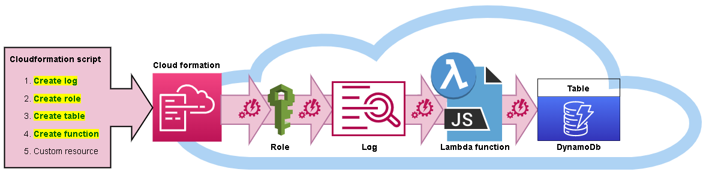
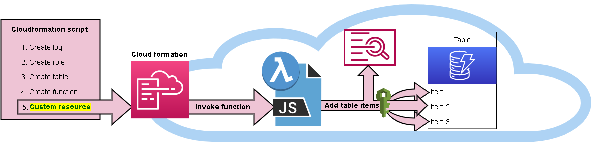
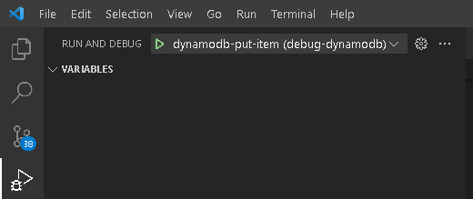

## Test Dynamodb table population

The research admin reports stack includes a dynamodb table that contains information related to publishing reports to end user via email.
Cloudformation has the language to create the dynamodb table, but not individual items within that table.
Therefore, [Lambda-backed custom resources](https://docs.aws.amazon.com/AWSCloudFormation/latest/UserGuide/template-custom-resources-lambda.html) are used to populate the dynamodb table, one for each item.

The process is depicted here:

1. Cloudformation creates each resource before invoking the custom resource:

   

2. Cloudformation creates the custom resource(s), which trigger the corresponding lambda function to add row(s) to the dynamodb table.
   

The javascript code depicted above can be tested locally outside of cloudformation using a vscode nodejs launch configuration.

### Prerequisites:

- **AWS CLI:** 
  If you don't have the AWS command-line interface, you can download it here:
  [https://docs.aws.amazon.com/cli/latest/userguide/install-cliv2.html](https://docs.aws.amazon.com/cli/latest/userguide/install-cliv2.html)
- **IAM Credentials:**
  The cli needs to be configured with sufficient [security credentials](https://docs.aws.amazon.com/general/latest/gr/aws-sec-cred-types.html#access-keys-and-secret-access-keys). IAM user principals are not allowed by BU policy, so these credentials can be issued through an STS token that you obtain through federated access. The credentials must apply to a role with policies sufficient to cover all of the actions to be carried out (stack creation, VPC/subnet read access, ssm sessions, secrets manager read/write access, etc.). Preferably an admin role and all policies will be covered.
- **Bash:**
  You will need the ability to run bash scripts. Natively, you can do this on a mac, though there may be some minor syntax/version differences that will prevent the scripts from working correctly. In that event, or if running windows, you can either:
  - Clone the repo on a linux box (ie: an ec2 instance), install the other prerequisites and run there.
  - Download [gitbash](https://git-scm.com/downloads)
- **Nodejs:** download [here](https://nodejs.org/en/download/)
- **Visual Studio Code:** download [here](https://code.visualstudio.com/Download)

### Steps:

1. Open vscode to the root directory where this git repository was cloned to.

2. In a bash prompt move to the correct subdirectory

   ```
   cd cloudformation/debug/dynamodb
   ```

3. In the .vscode subdirectory, there should be a launch.json file with a single launch configuration in it:

   ```
   {
     "version": "0.2.0",
     "configurations": [
       {
         "env": {
           "AWS_SDK_LOAD_CONFIG": "1",
           "AWS_PROFILE": "infnprd",
           "DEBUG_MODE": "mock-response",
           "REQUEST_TYPE": "Create"
         },
         "cwd": "${workspaceFolder}",
         "name": "dynamodb-put-item",
         "type": "node",
         "request": "launch",
         "program": "launch.js",
         "args": [
           "{ table: 'research-admin-reports-distribution'}",
           "{ entry: { \\\"EmailSubject\\\": { \\\"S\\\": \\\"Daily - Subaward Aging Report\\\" }, \\\"EmailList\\\": { \\\"S\\\": \\\"ciccarel@bu.edu, cdemarsi@bu.edu, mvergoni@bu.edu, rohare@bu.edu, megfol@bu.edu\\\" }, \\\"EmailCC\\\": { \\\"S\\\": \\\"\\\" }, \\\"ReportCd\\\": { \\\"S\\\": \\\"subaward_aging\\\" }, \\\"EmailText\\\": { \\\"S\\\": \\\"Attached is the daily run of the Subaward Aging Report.\\\" } } }"
         ]
       }
     ]
   }
   ```

   Make the necessary changes:

   - Set the correct `AWS_PROFILE` value
   - Set `configurations.args.table` for the correct name of the dynamodb table.
   - A sample entry has been provided in `configurations.args.entry`. Adjust this as necessary.

4. *[Optional]* Set a breakpoint somewhere in dynamodb.js.

5. Run the launch configuration.
   




1. Check the dynamodb table in the AWS management console or with the AWS CLI for the new entry.

   ```
   aws dynamodb execute-statement --statement 'SELECT * FROM "research-admin-reports-distribution"'
   ```

   