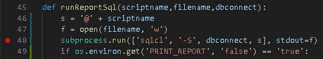
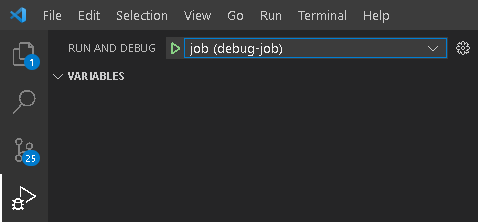
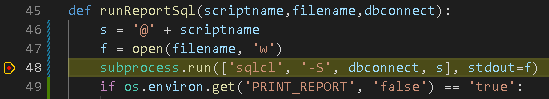

## Debug jobs locally

The following are directions on how to run a single report as a docker container in [visual studio code.](https://code.visualstudio.com/)
These directions are an extension of [Run a job locally](../RunLocally.md).
At the root of this project is a configuration file for a [Visual studio code multi-root workspace](https://code.visualstudio.com/docs/editor/multi-root-workspaces)

### Prerequisites:

- **[Baseline prerequisites](../RunLocally.md):** 
  You need these for steps that take you from the start through to a running docker container that can be triggered to execute a job.
- **Visual Studio Code:**
  Get vscode [here](https://code.visualstudio.com/Download)


### Steps:

1. **Run the docker container:**
   Follow the directions in [Run a job locally](../RunLocally.md) up to *(but not including)* running the docker container.
   The underlying docker image is built to include python being instrumented with the [debugpy](https://github.com/microsoft/debugpy) module.
   When the helper script is used to run the container, that container will be detached with python in a "listening" state that waits for a client debugger to attach to the process. For this to work, the container is run with a modified command that invokes `automated/loader.py` *(where the listener is created)*, instead of `automated/_loader.sh`.
   There are two scenarios for debugging:

   - **Full**

     In this scenario you would be attempting to generate a report AND invoke all of the AWS services that follow to distribute that report to end users. This means closely impersonating the AWS batch job by running the docker container with precisely the same [environment variables and command](https://docs.aws.amazon.com/batch/latest/userguide/job_definition_parameters.html#containerProperties) as it would within the aws batch service. This requires that the related resources have already been cloud-formed *(s3 bucket, dynamodb, cloudfront, events, etc.)*.

     Accept all defaults:
   
     ```
     cd cloudformation/debug/job
     sh docker.sh debug profile=[your_profile]
     ```
   
     Or, if the stack was cloud-formed with a non-default landscape, global tag, and report bucket name:
   
     ```
     cd cloudformation/debug/job
     sh main.sh debug 
       profile=[your_profile] \
       landscape=stg \
       global_tag=research-admin-reports2 \
       report_bucket_name=[name_of_the_reports3__bucket]
     ```
   
     <u>GLOBAL_TAG:</u> The default value for `global_tag` would be "research-admin-reports", which would be overridden to prevent resource name collisions in the case of the account having more than one deployment of this stack at a time.
     The names of all resources that comprise a stack are prefixed with this value.
   
   - **Private:**
   
     In this scenario you would merely be attempting to generate a report and view its output. This does not require any cloud infrastructure exist. You need only access to the kuali database. Two key environment variables need to be issued to the container when it is run:
     
     - **LOCAL_PARMS:** 
       In the conventional scenario, variables prefixed with `"PARMSTORE_"` are considered to indicate the name of a parameter in the aws ssm parameter store, and the app will obtain values by performing cli lookups against that service. However, if the LOCAL_PARMS environment variable is set to true, the app will consider that any `"PARMSTORE_"` variable contains the value itself, not the parameter name in the store, and no cli lookup is necessary.
     - **PUBLISH_REPORTS:** 
       The app will always attempt to upload reports to the s3 bucket and issue emails to end users in all cases EXCEPT when `"PUBLISH_REPORTS"`is set to "false", in which case the app will end off after generation of the excel files.
     
     The following is an example of running outside of any batch cloud infrastructure - report content is printed to the console, excel files are generated, and nothing else happens.
     
     ```
     sh main.sh debug \
       profile=[your_profile] \
       local_parms=true \
       publish_reports=false \
       landscape=stg \
       db_user=KCBATCH \
       db_pswd=[db_password] \
       db_host=kuali-oracle-stg.clb9d4mkglfd.us-east-1.rds.amazonaws.com
     ```
   
2. **Set a breakpoint:**
   Put a breakpoint somewhere you expect execution to go:

     

3. **Run the vscode launch configuration:**
   A launch configuration is provided in this repo: `.vscode/launch.json`
   You should see it listed as "job (debug-job)" in the debug menu:

     

   

   Click on the green arrow.
   Execution should stop on the breakpoint you set:

     

   To stop debugging, type `Shift+F5`.
   This will stop the debugger AND the container will stop and be deleted since the background listener process is ended.